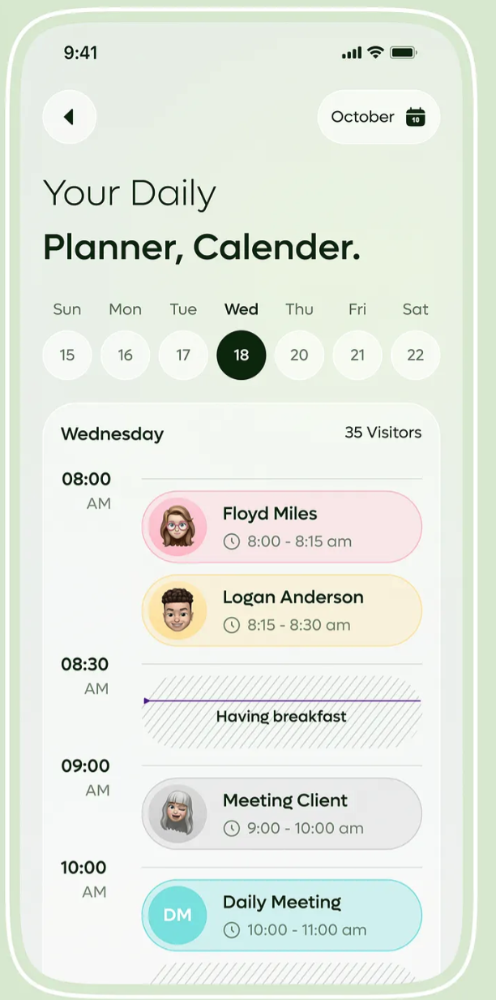

# 菇卡应用实现说明

## 项目概述

这是一个基于 UNIAPP 的菇卡应用，实现了完整的自我觉察与行为练习卡片系统。

## 已实现功能

### 2. 五个核心 Tab 页面

#### 日记
- ✅ 日记时间线（顶部日期组件可以点击）
- ✅ 今日日记入口
- ✅ 写日记页面

#### 菇卡页面（）
- ✅ 今天要练的菇卡列表
- ✅ 今天的小日记（微日记）
- ✅ 心情选择器
- ✅ 照片上传
- ✅ 展开写成完整日记

#### 发现（pages/discovery/）
- ✅ 菇卡广场
- ✅ 日记广场
- ✅ 切换标签
- ✅ 共鸣/收藏/想练功能
- ✅ 我也有类似经历功能

#### 我（pages/profile/）
- ✅ 用户信息卡片
- ✅ 菇卡统计
- ✅ 日记统计
- ✅ 社交统计
- ✅ 功能菜单

## 核心功能流程

### 日记 → 菇卡
1. 用户在日记页面写日记
2. 点击"从这条日记生成新菇卡"
3. 系统自动提取觉察句草稿
4. 用户完善四个部分
5. 保存后出现在菇卡库

### 菇卡 → 练习
1. 用户在菇卡详情页查看"我要怎么去用"
2. 点击"记录新的练习"
3. 填写情境、行动、感受
4. 保存练习记录
5. 更新统计信息

### 发现广场
1. 用户公开自己的菇卡/日记
2. 出现在发现广场
3. 其他用户可以：
   - 共鸣（点赞）
   - 收藏
   - 想练这张卡（复制到自己的菇卡库）
   - 我也有类似经历（引导写日记）

## 数据模型

### ShroomCard（菇卡）
- 四个核心部分：seedSentence, myUnderstanding, usageItems, practiceCases
- 元数据：tags, visibility, sourceType
- 统计：practiceCount, resonanceCount, favoriteCount, quoteCount

### ShroomPractice（练习记录）
- context（情境）
- action（做了什么）
- feeling（感受如何）
- result（结果评估）
- reflection（复盘）

### ShroomDiary（日记）
- content（内容）
- mood（情绪）
- tags（标签）
- visibility（隐私设置）
- generatedCards（生成的菇卡）

## 待完善功能

## 技术栈

